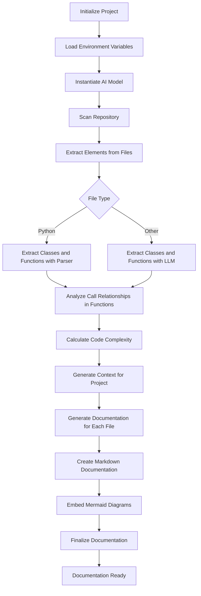
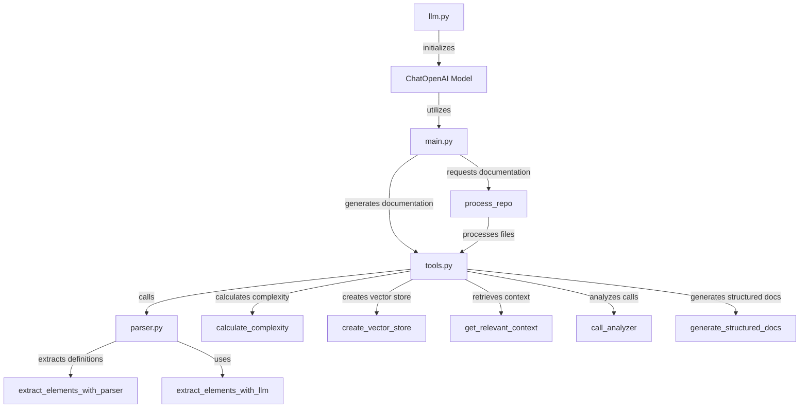
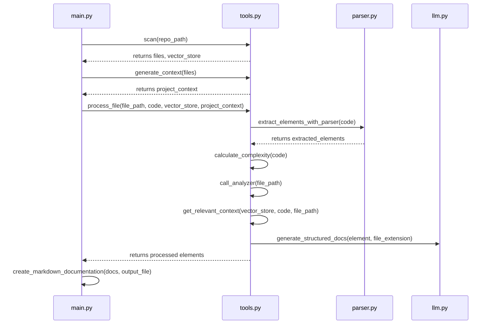

# Documentation

# Overview

The project is focused on automating the documentation generation for Python codebases using AI-driven techniques. It leverages a language model to analyze code files, extract relevant elements such as classes and functions, calculate code complexity, and create structured Markdown documentation along with visual diagrams to enhance understanding. Key components include file parsing, context retrieval, and summarization, all aimed at providing concise and meaningful documentation for developers.



# Architecture

1. **llm.py**: This file initializes the ChatOpenAI model for generating documentation, loading environment variables and instantiating the model for prompt creation and interactions within the project.

2. **main.py**: It implements an AI agent that generates concise documentation for codebases by leveraging a language model and repository processing tools, facilitating user requests for documentation summaries through integration with `tools.py`.

3. **parser.py**: This file offers functionality to extract class and function definitions from Python code using either a Tree-sitter parser or an AI model, enhancing documentation and analysis by connecting with the `llm` module for AI-driven extraction.

4. **tools.py**: Serving as a comprehensive tool, this file analyzes and documents Python codebases by processing files, extracting relevant components, calculating code complexity, and generating structured Markdown documentation with diagrams, utilizing various project components for AI-enhanced insights.



# Core Functionality

The core function of this project is the **automated documentation generation for Python codebases**, which utilizes AI-driven techniques to analyze code, extract relevant components, and create structured Markdown documentation. This process involves parsing code files to identify classes and functions, calculating code complexity, and producing clear documentation along with visual diagrams to aid developers in understanding the code's functionality and structure.



# Project Components

## `llm.py`

### File Overview
The `llm.py` file initializes the ChatOpenAI model for generating documentation within the project. It contains code to load environment variables and instantiate an AI model, which is then utilized in `main.py` for creating prompts and managing interactions with the model.

## `main.py`

### File Overview
This file implements an AI agent that generates concise documentation for codebases by utilizing a language model and a tool for processing repositories. It connects to the `process_repo` function from `tools.py` and the language model defined in `llm.py`, facilitating user interaction to request documentation summaries.

## `parser.py`

### File Overview
This file provides functionality to extract class and function definitions from Python code using either the Tree-sitter parser or an AI model, depending on the file extension. It connects with the `llm` module for AI-driven extraction and is utilized by the `tools.py` file to enhance code documentation and analysis within the project.

The primary functionality of this file is to facilitate the extraction of class and function definitions from Python code by utilizing the Tree-sitter parser, which analyzes the Abstract Syntax Tree (AST) of the code. Depending on the file extension, it may also employ an AI model for similar extraction tasks, ensuring flexibility in handling various Python files.

The core extraction logic begins with querying the Tree-sitter parser to capture relevant nodes from the root of the AST. The code first checks for the presence of class and function definitions:

```python
captures = query.captures(tree.root_node)

try:
    captures["class"]
    classes = True
except:
    classes = False

try:
    captures["function"]
    functions = True
except:
    functions = False
```

This segment establishes whether classes and functions exist in the code, which is critical for subsequent processing. It uses exception handling to determine the presence of these components, setting flags that guide the extraction process.

If classes are detected, the code iterates through each captured class node, further delving into its children to identify class names and their corresponding blocks. This is crucial for understanding the structure of the class:

```python
if len(captures) > 0:
    if classes:
        for i in range(len(captures["class"])):
            for child in captures["class"][i].children:
                if child.type == 'identifier':
                    class_name = child.text.decode('utf8') 
                if child.type == 'block':
                    class_block = child.text.decode('utf8') 

                    method_query = PYTHON_LANGUAGE.query("""
                    (function_definition
                    name: (identifier) @methodname
                    parameters: (parameters) @methodparams
                    body: (block) @methodbody
                    ) @method
                    """)

                    method_captures = method_query.captures(child)
```

This block not only captures class names but also sets up a method query to extract function definitions within each class. By utilizing a structured query language specific to Tree-sitter, it captures the method name, parameters, and body, allowing for detailed documentation of class methods.

In summary, this file serves as a vital component for the project's goal of automating documentation generation. It efficiently parses Python code to extract and structure class and function information, laying the groundwork for enhanced documentation and code analysis.

### Functions and Classes

## `extract_elements_with_parser(code) -> list`
Extract classes and functions using tree-sitter.

**Parameters**:
| Name | Type | Default | Description |
|------|------|---------|-------------|
| `code` | `str` | `None` | The source code from which to extract classes and functions. |

**Returns**:
| Type | Description |
|------|-------------|
| `list` | A list of dictionaries representing extracted classes and functions, including their names, parameters, and code. |

## `extract_elements_with_llm(code, file_extension) -> list`
Extract classes and functions using llm.

**Parameters**:
| Name | Type | Default | Description |
|------|------|---------|-------------|
| `code` | `str` | `None` | The code to analyze for class and function definitions. |
| `file_extension` | `str` | `None` | The file extension of the codebase being documented. |

**Returns**:
| Type | Description |
|------|-------------|
| `list` | A list of dictionaries containing extracted class and function definitions. |

## `tools.py`

### File Overview
The file serves as a comprehensive tool for analyzing and documenting Python codebases by processing each file in a repository, extracting relevant components, calculating code complexity, and generating structured Markdown documentation with embedded diagrams. It utilizes various components from the project, such as the `llm` for generating summaries and prompts, `extract_elements_with_parser` and `extract_elements_with_llm` for code extraction, and integrates with a vector store for context retrieval, thereby enhancing the documentation process through AI-driven insights.

The file plays a crucial role in automating the documentation generation for Python codebases by analyzing source files, extracting pertinent components, and calculating code complexity metrics. 

At its core, the `calculate_complexity` function is integral to this analysis, as it computes various complexity metrics for a given code snippet. By utilizing the Abstract Syntax Tree (AST) module, it parses the code and evaluates factors such as cyclomatic complexity, which assesses the control flow of the code, and other metrics that contribute to a holistic understanding of code maintainability.

```python
def calculate_complexity(code: str) -> Dict[str, float]:
    """Calculate various complexity metrics for a code snippet"""

    tree = ast.parse(code)

    cyclomatic = 1
    operators = set()
    operands = set()
    
    for node in ast.walk(tree):
        if isinstance(node, (ast.If, ast.For, ast.While, ast.And, ast.Or)):
            cyclomatic += 1
        if isinstance(node, ast.With):
            cyclomatic += 1
        if isinstance(node, ast.Try):
            cyclomatic += len(node.handlers) + (1 if node.finalbody else 0)
            
        if isinstance(node, ast.operator):
            operators.add(type(node).__name__)
        elif isinstance(node, ast.cmpop):
            operators.add(type(node).__name__)
        elif isinstance(node, ast.boolop):
            operators.add(type(node).__name__)
        elif isinstance(node, ast.Name) and isinstance(node.ctx, ast.Load):
            operands.add(node.id)
        elif isinstance(node, ast.Constant):
            operands.add(repr(node.value))
    # ... more complexity calculations ...

    return {
        'cyclomatic': cyclomatic,
        'halstead_volume': halstead_volume,
        'depth': depth,
        'score': score
    }
```

This function thus empowers developers to gauge the maintainability and understandability of their code, which is essential for long-term project health. The outputs from this function are pivotal for generating structured Markdown documentation, as they provide insights into the complexity of various code segments, ultimately facilitating better communication and comprehension among team members. 

Overall, the file encapsulates the process of evaluating Python codebases through advanced analysis techniques, leveraging AI capabilities to enhance the quality and clarity of the generated documentation.

### Functions and Classes

## `CallVisitor`
A class that visits function definitions and tracks function calls within them.

**Methods**:

## `visit_FunctionDef(node) -> void`


**Parameters**:
| Name | Type | Default | Description |
|------|------|---------|-------------|
| `node` | `ast.FunctionDef` | `None` | The AST node representing a function definition. |

**Returns**:
| Type | Description |
|------|-------------|
| `void` |  |


## `scan(repo_path) -> tuple`
Collects raw file contents and basic structure from a repository.

**Parameters**:
| Name | Type | Default | Description |
|------|------|---------|-------------|
| `repo_path` | `str` | `None` | The file path of the repository to scan. |

**Returns**:
| Type | Description |
|------|-------------|
| `tuple` | A tuple containing a list of preliminary documents and a vector store. |

## `generate_context(files) -> str`
Create project overview before deep file analysis

**Parameters**:
| Name | Type | Default | Description |
|------|------|---------|-------------|
| `files` | `list` | `None` | A list of dictionaries containing file paths and their respective summaries. |

**Returns**:
| Type | Description |
|------|-------------|
| `str` | A summary of the project's purpose and main components based on the provided file summaries. |

## `calculate_complexity(code) -> dict`
Calculate various complexity metrics for a code snippet

**Parameters**:
| Name | Type | Default | Description |
|------|------|---------|-------------|
| `code` | `str` | `None` | The source code as a string to analyze for complexity metrics |

**Returns**:
| Type | Description |
|------|-------------|
| `dict` | A dictionary containing cyclomatic complexity, Halstead volume, depth of the code, and a combined complexity score |

## `process_file(file_path, code, vector_store, project_context) -> dict`
Create structured documentation for a file.

**Parameters**:
| Name | Type | Default | Description |
|------|------|---------|-------------|
| `file_path` | `str` | `None` | The path to the file being analyzed. |
| `code` | `str` | `None` | The source code of the file. |
| `vector_store` | `unknown` | `None` | A vector store used for context retrieval. |
| `project_context` | `unknown` | `None` | The context of the project to which the file belongs. |

**Returns**:
| Type | Description |
|------|-------------|
| `dict` | A dictionary containing the file path, summary, extracted elements with documentation, call map, code, and complexity. |

## `create_vector_store(files) -> FAISS`
Creates a vector store from a list of files by splitting their content into chunks and converting them into a document format.

**Parameters**:
| Name | Type | Default | Description |
|------|------|---------|-------------|
| `files` | `list` | `None` | A list of dictionaries, each containing 'content' and 'file_path' keys. |

**Returns**:
| Type | Description |
|------|-------------|
| `FAISS` | A FAISS vector store created from the processed documents. |

## `call_analyzer(file_path) -> dict`
Analyze Python file and extract call relationships using AST

**Parameters**:
| Name | Type | Default | Description |
|------|------|---------|-------------|
| `file_path` | `str` | `None` | The path to the Python file to be analyzed. |

**Returns**:
| Type | Description |
|------|-------------|
| `dict` | A dictionary mapping function names to lists of called functions or attributes. |

## `get_relevant_context(vector_store, code, current_file_path, k) -> str`
Retrieve relevant code snippets from other files

**Parameters**:
| Name | Type | Default | Description |
|------|------|---------|-------------|
| `vector_store` | `object` | `None` | The vector store used for similarity search |
| `code` | `str` | `None` | The code snippet to search for similar contexts |
| `current_file_path` | `str` | `None` | The path of the current file to exclude from results |
| `k` | `int` | `5` | The number of similar results to retrieve |

**Returns**:
| Type | Description |
|------|-------------|
| `str` | A string containing relevant context or a message indicating no relevant context found |

## `identify_excludable_files(file_paths) -> list`
Identifies files that should be excluded from documentation generation.

**Parameters**:
| Name | Type | Default | Description |
|------|------|---------|-------------|
| `file_paths` | `list` | `None` | A list of file paths in the repository. |

**Returns**:
| Type | Description |
|------|-------------|
| `list` | A list of file paths that are excluded from documentation generation. |

## `split_repo(repo_path) -> list`
Splits the repository into logical parts (file by file) to summarize it. Preserves original file formatting for accurate parsing.

**Parameters**:
| Name | Type | Default | Description |
|------|------|---------|-------------|
| `repo_path` | `str` | `None` | The path to the repository to be split. |

**Returns**:
| Type | Description |
|------|-------------|
| `list` | A list of dictionaries containing the file paths and their respective content for the files in the repository. |

## `generate_structured_docs(element, file_extension) -> str`
Generates structured API documentation for a given function or class, extracting relevant information such as name, description, parameters, and return types.

**Parameters**:
| Name | Type | Default | Description |
|------|------|---------|-------------|
| `element` | `dict` | `None` | A dictionary containing information about the function or class, including its code, name, and parameters. |
| `file_extension` | `str` | `None` | The file extension of the code, used to determine the language context for the documentation. |

**Returns**:
| Type | Description |
|------|-------------|
| `str` | The generated structured API documentation in a formatted string, or an error message if the documentation generation fails. |

## `create_markdown_documentation(docs, output_file) -> str`
Creates a Markdown documentation file with summaries and Mermaid diagrams.

**Parameters**:
| Name | Type | Default | Description |
|------|------|---------|-------------|
| `docs` | `list` | `None` | List of dictionaries with documents containing file paths, summaries, elements, callmaps, and complexity metrics. |
| `output_file` | `str` | `None` | Path to save the Markdown file. |

**Returns**:
| Type | Description |
|------|-------------|
| `str` | A message indicating the location of the created Markdown documentation file. |

## `process_repo(repo_path, output_dir) -> None`
Processes a repository file by file, generates documentation in Markdown format with embedded Mermaid diagrams.

**Parameters**:
| Name | Type | Default | Description |
|------|------|---------|-------------|
| `repo_path` | `str` | `None` | Path to the local repository directory |
| `output_dir` | `str` | `None` | Directory to save the documentation |

**Returns**:
| Type | Description |
|------|-------------|
| `None` | This function does not return a value. |

