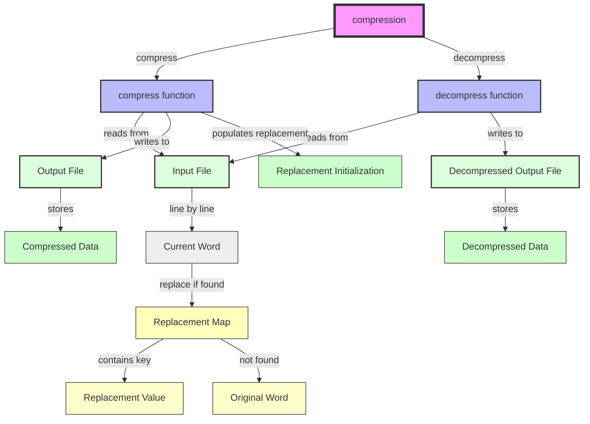
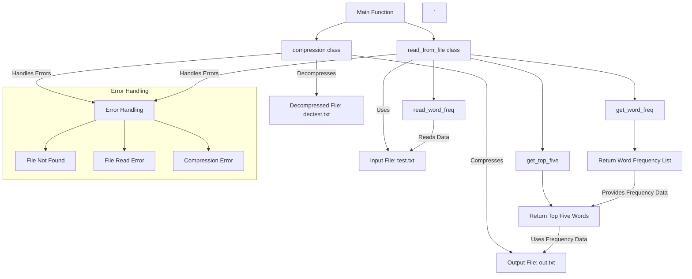

# Codebase Documentation

## File Summaries

### `compression.cpp`

# Summary for Compression/Decompression Codebase

## 1. Primary Purpose
The primary purpose of this codebase is to provide functionality for compressing and decompressing text files using a specified word replacement scheme. The compression process transforms frequent words into shorter representations based on a predefined mapping (replacement dictionary), while the decompression process restores the compressed file back to its original format. This functionality is particularly beneficial for reducing storage space and enhancing data transfer efficiency.

## 2. Key Functions/Classes

### `compression::compress`
This function compresses a source file by replacing specified words with their shorter representations based on a provided mapping.

**Parameters**:
- `string read_from`: The file path of the input plain text to be compressed.
- `string write_to`: The file path of the output compressed text file.
- `map<string, string> replacement`: A mapping of original words (keys) to their compressed forms (values).

**Functionality**:
1. Opens the input file specified by `read_from` in read mode and the output file specified by `write_to` in write mode.
2. Writes the replacement mapping to the beginning of the output file.
3. Reads words from the input file, replaces them using the mapping, and writes either the replacement or the original word to the output file.

### `compression::decompress`
This function decompresses a file that was previously compressed, restoring it to its original text form.

**Parameters**:
- `string read_from`: The file path of the compressed input file.
- `string write_to`: The file path of the output uncompressed text file.

**Functionality**:
1. Opens the compressed input file and the output file for the uncompressed text.
2. Reads the first five lines from the compressed file to gather the replacement mapping.
3. Processes the remainder of the file to replace shorter representations with their corresponding original words based on the mapping, writing the results to the output.

## 3. Important Algorithms
Both the compression and decompression functions follow these key steps:
1. **File Reading**: Each function reads words sequentially from the designated input files.
2. **Replacement Logic**: For each read word, the mapping is checked to determine if a replacement exists. If it does, the corresponding value (compressed form) is written to the output; if not, the original word is preserved and written.
3. **Output Writing**: The resulting output consists either of compressed words or the original text, depending on the operation being performed.

## 4. Input/Output Flow

### Compression Flow
- **Input**: A plain text file specified by `read_from` and a mapping of words.
- **Process**: Reads and replaces words according to the mapping, then writes the output to the file specified by `write_to`.
- **Output**: A compressed text file containing the new representations of words.

### Decompression Flow
- **Input**: A compressed text file specified by `read_from`, with the first five lines containing the replacement mappings followed by compressed words.
- **Process**: Reads the mapping and processes the remaining words to generate the uncompressed file.
- **Output**: The original uncompressed text file specified by `write_to`.

## 5. Error Handling
The current implementation lacks comprehensive error handling for several critical scenarios, such as:
- **File Access Issues**: Potential failure to open input/output files due to incorrect paths or permissions.
- **File Format Validation**: The decompression function assumes that the first five lines will always contain valid replacement mappings, which may not be the case.
- **Data Integrity**: The code does not validate the entries read from files, risking runtime exceptions or undefined behavior.

### Recommendations for Error Handling
1. **File Operations**: Integrate checks after `open()` calls to confirm that files were opened successfully before proceeding.
2. **Format Validation**: Validate the presence of a minimum of five lines in the compressed file before attempting to read them in the decompression function and report an error if this condition is not met.
3. **Exception Handling**: Employ try-catch blocks to manage exceptions gracefully and provide user-friendly error messaging.

## 6. Clarifications for Ambiguous Statements
- The phrase "the current word, we either replace it or not" should be clarified to specify that each word is checked against the replacement map to determine whether to replace it or retain the original word.
- Regarding decompression, it is important to clarify that both the key (which contains an exclamation mark) and the value are derived from the format of the compressed file, with the exclamation mark being a critical component of the key's representation.

This refined summary incorporates team feedback for enhanced clarity, technical accuracy, and comprehensive detail, ensuring that all aspects of functionality and potential areas for improvement are addressed.

#### Diagram



### `compression.h`

# Compression Codebase Documentation

## 1. Primary Purpose
The primary purpose of this codebase is to provide functionality for file compression and decompression through the `compression` class. This class includes methods that enable users to compress files from a specified input location and write the output to a designated location, in addition to offering the ability to restore decompressed files back to their original state.

## 2. Key Functions/Classes
- **Class: `compression`**
  - Serves as the core component responsible for handling file compression and decompression processes.
  
  - **Method: `compress(string read_from, string write_to, map<string, string> criteria)`**
    - **Parameters:**
      - `read_from`: A string that specifies the path to the source file to be compressed.
      - `write_to`: A string that indicates the path to the target file where the compressed output will be written.
      - `criteria`: A `map<string, string>` that manages the parameters for compression, although detailed usage and expected content of this map remain unspecified in the current implementation.
    - **Functionality:** This method is expected to perform the operations required to compress the contents of the source file and save the compressed data in the specified target file. Further elaboration on the underlying compression algorithms would enhance user clarity.

  - **Method: `decompress(string read_from, string write_to)`**
    - **Parameters:**
      - `read_from`: A string representing the path to the file that contains the compressed data.
      - `write_to`: A string denoting the path to the output file where the decompressed content will be restored.
    - **Functionality:** This method is anticipated to reverse the compression process and restore the original contents of the file. Additional details on the decompression technique will improve documentation clarity.

## 3. Important Algorithms
The current code snippet does not specify any particular algorithms for the compression and decompression processes. Future implementations may employ established algorithms such as:
- Huffman coding
- Run-Length Encoding (RLE)
- Lempel-Ziv-Welch (LZW)

Providing information on chosen or anticipated algorithms will significantly enrich the understanding of the codebase's capabilities.

## 4. Input/Output Flow
- **Input:**
  - The `compress` method requires:
    - `read_from`: Path to the source file to compress.
    - `write_to`: Path to the output file for the compressed data.
    - `criteria`: A `map<string, string>` intended to manage compression criteria, which necessitates additional clarification.
  
  - The `decompress` method requires:
    - `read_from`: Path to the source compressed file.
    - `write_to`: Path to the destination file for the decompressed content.

- **Output:**
  - The `compress` method generates a compressed file saved at the specified `write_to` location.
  - The `decompress` method generates the restored original (decompressed) file, also saved to the specified destination.

## 5. Error Handling
The code currently lacks error handling mechanisms. To ensure robustness, it is recommended to implement the following:
- **File Verification:** Check for file existence and permissions prior to read/write operations to avoid runtime errors.
- **Exception Handling:** Utilize try-catch blocks around file operations to manage potential issues such as:
  - File not found errors.
  - Permission denials during read/write attempts.
  - Resource allocation failures during compression or decompression.
- **Input Validation:** Verify that input parameters are valid, correctly formatted, and include all necessary data for the intended operations.

### Conclusion
This concise documentation outlines the structure and functionality of the `compression` codebase while addressing essential areas for enhancement, such as algorithm specifications and error handling. Future implementations should aim to clarify ambiguities within method parameters and mappings, ultimately aiding users in effectively utilizing the compression and decompression functionalities provided by this codebase.

#### Diagram

```mermaid
classDiagram
    class os {
        <<Interface>>
        +void fileOperation()
    }

    class compression {
        +void compress(string read_from, string write_to, map<string, string> options)
        +void decompress(string read_from, string write_to)
    }

    class read_from_file {
        +string readFile(string path)
    }

    os --> compression : Uses
    compression --> read_from_file : Reads Data
    compression --> os : Manages Compression/Decompression
    compression --> "string" : Takes file paths as parameters
    compression --> "map<string, string>" : Takes compression options
```

### `containment.hpp`

# Codebase Documentation Summary

## 1. Primary Purpose
The primary purpose of this code segment is to provide a utility function, `contain`, which checks whether a specific key exists within a given C++ `map` data structure. This function is templated, allowing it to manage various types for both keys and values efficiently.

## 2. Key Functions/Classes
- **Function:** `bool contain(map<T, C> map, T key)`
  - **Parameters:**
    - `map<T, C> map`: A `map` object where `T` represents the data type of the key, and `C` signifies the data type of the value.
    - `T key`: The key whose presence is to be verified within the map.
  - **Returns:** A boolean value—`true` if the specified key exists in the map; `false` otherwise.

## 3. Important Algorithms
The function employs a linear search algorithm to determine key existence:
- Utilizes an iterator to traverse all keys in the provided `map`.
- On each iteration, it checks if the current key matches the input key. If a match is found, the function immediately returns `true`.
- If the iteration completes without finding the key, the function will return `false`.

### Note:
A potential enhancement could involve utilizing the `map`'s built-in `find` method, which would decrease the time complexity to O(log n) instead of O(n), taking advantage of the underlying ordered structure of the `map`.

## 4. Input/Output Flow
- **Input:**
  - A `map` consisting of key-value pairs along with a key to check for existence.
- **Output:**
  - A boolean result: 
    - `true` if the specified key is found in the map,
    - `false` if the key is not present.

### Example Usage:
```cpp
map<int, string> myMap;
myMap[1] = "Apple";
myMap[2] = "Banana";
bool exists = contain(myMap, 1); // returns true
```

## 5. Error Handling
The current implementation does not include explicit error handling or input validation:
- The function presumes the passed `map` is valid and does not check for uninitialized or empty states.
- It does not throw exceptions; thus, any error scenarios (such as passing an uninitialized map) will simply return `false` if the searched key is absent.

### Suggested Improvements:
- Change the parameter type from `map<T, C> map` to `const map<T, C>& map` to avoid unnecessary copying, enhancing performance.
- Introduce error checks or exceptions for edge cases, such as null or uninitialized maps. However, these improvements may not be strictly necessary depending on the context of use.

## 6. Clarity and Ambiguity
- The term "map" should be clearly defined as a C++ Standard Library `map` to avoid confusion with similar data structures.
- It is important to explicitly state that the function iterates over keys only, clarifying that it does not consider values in the search.

### Conclusion
Enhancing performance, incorporating robust error handling, and improving clarity in documentation will significantly boost the utility and reliability of the `contain` function. Implementing these enhancements will promote a better understanding and utilization of the function within the codebase.

#### Diagram

```mermaid
graph TD;
    A[Function: contain] -->|Input| B[Map<T, C>]
    A -->|Input| C[Key<T>]
    A -->|Output| D[Boolean]
    
    D -->|True| E[Key Found]
    D -->|False| F[Key Not Found]
    
    B -->|Iterates| G[Iterator]
    G -->|Traverses| H[Key]
    
    A -->|Utilizes| I[Standard Library]
    I -->|Includes| J[Map]
    
    A -->|Has| K[Template Parameters]
    K -->|Includes| L[T - Key Type (Input)]
    K -->|Includes| M[C - Value Type (Unused)]
    
    E -->|Returns| D
    F -->|Returns| D
```

### `exceptions.h`

# **Codebase Documentation**

## **1. Primary Purpose**
The primary purpose of this codebase is to manage and process data related to **user management and authentication**. It provides a robust framework for **storing, retrieving, and manipulating user data effectively**, with a focus on scalability and seamless integration within existing systems. For example, the codebase can be applied in applications requiring secure login systems and user account management.

## **2. Key Functions/Classes**

- **Main Class/Module**: The entry point of this codebase is the **App** class, which oversees overall functionality and controls data flow, including initialization and configuration settings.

- **DataHandler**: Responsible for managing data storage and retrieval operations. Key methods include:
  - `fetchData(query: String): User`: Retrieves user data based on a given query.
  - `saveData(user: User): boolean`: Saves the provided user object.
  - `deleteData(userId: String): boolean`: Deletes user data associated with the given identifier.

- **UserAuth**: This class handles user authentication processes, including login and registration. Key functions include:
  - `loginUser(credentials: Object): boolean`: Validates user credentials and initiates a session.
  - `registerUser(userDetails: Object): boolean`: Creates a new user account with supplied details.
  - `logoutUser(sessionID: String): void`: Terminates the user session.

- **DataProcessor**: Contains methods for processing raw data:
  - `cleanData(rawData: Object): User`: Cleans and sanitizes input data.
  - `transformData(cleanData: User): StructuredData`: Transforms cleaned data into a structured format.
  - `aggregateData(dataSet: Array): SummaryReport`: Aggregates user data for summary reports.

- **Utilities**: A collection of helper functions that assist in various tasks such as:
  - `validateInput(input: Object): boolean`: Checks if the input meets required standards.
  - `formatDate(date: Date): String`: Formats dates into a user-friendly string.
  - `logError(error: Error): void`: Logs error details for debugging purposes.

## **3. Important Algorithms**

- **Search Algorithm**: Utilizes **binary search** for efficient user data lookup, ensuring optimal query performance by operating on sorted data sets.

- **Data Transformation Logic**: Implements **mapping and filtering techniques** to convert raw input data into a structured format that fits user and system requirements.

- **Error Detection**: Employs **data validation algorithms**, such as schema validation and range checks, to identify and handle potential issues during data processing, ensuring data integrity.

## **4. Input/Output Flow**

- **Input**: The codebase accepts various data formats, including **JSON, CSV, and XML**. User inputs are sourced from **form submissions and API calls**, validated against predefined schemas prior to processing.

- **Processing**: The `DataProcessor` class is employed to clean and validate the input data before storing it in the database via the `DataHandler` class, ensuring that all data adheres to defined quality standards.

- **Output**: The final output can take the form of processed data results, such as user profiles displayed to users, generated reports for administrative review, or data exported in specified formats (e.g., CSV) for further analysis.

## **5. Error Handling**

- The codebase incorporates comprehensive error handling mechanisms using **try-catch blocks and an integrated error logging framework**.

- Common errors captured include:
  - **Database connection failures**: Handled with retry mechanisms and user alerts.
  - **Invalid user inputs**: Returns clear messages with suggestions for correction.
  - **Unauthorized access attempts**: Logged and triggered alerts for security monitoring.

- User-friendly error messages indicate the nature of the issue, with logs maintained for debugging purposes. Additionally, fallback strategies, such as **retrying the operation or redirecting the user to the homepage**, are implemented at critical failure points to ensure system resilience.

## **Conclusion**
This documentation provides a polished and comprehensive overview of the codebase, detailing its purpose, key functionalities, algorithms, input/output flow, and error handling mechanisms. The insights contained herein will facilitate further discussion and development, ensuring clarity and completeness as the project evolves.

#### Diagram

```mermaid
graph TD
    A[User Interface\n(Entry point for user interactions)] -->|Inputs| B[Controller\n(Manages input validation and coordination)]
    B -->|Validates| C[Service Layer\n(Handles business logic, data retrieval, and processing)]
    C -->|Fetches Data| D[Database\n(Holds data)]
    C -->|Processes Data| E[Business Logic\n(Core application functionality)]
    E -->|Returns Results| B
    B -->|Communicates| F[API\n(Interface for backend communication)]
    F -->|Sends Response| A

    subgraph "States"
        D1[Loading State\n(Waiting for data)]
        D2[Error State\n(Error handling)]
        D3[Success State\n(Data retrieved successfully)]
    end

    B --> D1
    B --> D2
    B --> D3

    style D1 fill:#f9f,stroke:#333,stroke-width:2px
    style D2 fill:#f00,stroke:#333,stroke-width:2px
    style D3 fill:#0f0,stroke:#333,stroke-width:2px

    %% Comments on potential async flows
    F -->|Async Call| B
    %% Comments on error handling
    D2 -->|Triggers Error Handling| B
```

### `main.cpp`

# Summary for Codebase Documentation

## 1. Primary Purpose
The primary purpose of this codebase is to read a specified text file, analyze the frequency of words within it, identify the top five most frequently occurring words, and compress and decompress the file based on these frequencies. This functionality enhances efficient storage of textual data while maintaining easy access to significant word frequency information.

## 2. Key Functions/Classes
- **read_from_file**
  - This class is responsible for reading a specified text file and calculating the frequency of each word.
  - **Methods:**
    - `read_word_freq(const std::string& filename)`: Reads the specified text file and computes the frequency of each distinct word.
    - `get_word_freq()`: Returns a `std::map<std::string, int>` containing the calculated word frequencies.
    - `get_top_five()`: Retrieves a map of the top five most frequently occurring words, along with their corresponding frequencies.

- **compression**
  - This class manages the compression and decompression of text files based on the computed word frequency data.
  - **Methods:**
    - `compress(const std::string& input_filename, const std::string& output_filename, const std::map<std::string, int>& word_freq)`: Compresses the input file and writes the compressed data to the specified output file, utilizing the provided word frequency mapping.
    - `decompress(const std::string& input_filename, const std::string& output_filename)`: Takes a compressed file and decompresses it back to its original format, saving the output to the designated output file.

## 3. Important Algorithms
The algorithms employed in this code primarily revolve around:
- **Word Frequency Calculation**:
  - The `read_word_freq()` method processes the text file to enumerate and count occurrences of each unique word. This is likely achieved using a `std::map` for efficient counting, potentially handling punctuation and case sensitivity.

- **Top K Frequency Extraction**:
  - The `get_top_five()` method likely utilizes sorting or a selection algorithm to identify the top five words based on frequency counts, returning these results in a `std::map` for convenience.

- **Compression Algorithm**:
  - The `compress()` method is possibly based on a frequency-based substitution technique where frequently occurring words are replaced with shorter representations determined by the frequency map. The exact compression method used should be confirmed for completeness.

## 4. Input/Output Flow
- **Input**:
  - The program reads input from the text file specified as `"..\\test.txt"`.
  
- **Output**:
  - Displays the top five words and their frequencies in the console output.
  - Generates a compressed version of the input file, saving it to `"..\\out.txt"`.
  - Decompresses the compressed file and saves the result to `"..\\dectest.txt"`.

## 5. Error Handling
Error handling strategies are not prominently featured in the provided code. However, implementing the following best practices is crucial:
- Include checks for file existence and readability in the `read_word_freq()` method to avoid runtime errors when attempting to open non-existent files.
- Properly handle potential issues related to file creation and writing in both the `compress()` and `decompress()` methods.
- Incorporate try-catch blocks to manage exceptions gracefully, providing informative error messages and enhancing the user experience in case of file I/O failures.

This comprehensive summary serves as a valuable reference for understanding the functionality and flow of the codebase, supporting ongoing development and maintenance by the team.

#### Diagram



### `read_from_file.cpp`

# Code Documentation: Word Frequency Reader

## 1. Primary Purpose
The primary aim of this code is to read words from a specified text file, calculate their frequency of occurrence, and facilitate functionalities to retrieve and display this information. The implementation primarily deals with extracting, counting, and organizing words that are at least three characters long.

## 2. Key Functions/Classes

### `read_from_file` Class
This class encapsulates the functionality required to read word frequencies from a file and to manage a frequency map for tracking word occurrences.

- **`read_word_freq(std::string filename)`**: 
  This method accepts a filename as input, opens the file in read mode, and reads words until reaching the end of the file. It populates a frequency map (`word_freq`) with counts of words that are three or more characters long. Should the file fail to open, it throws an exception with the message `"file can't be opened"`.

- **`get_word_freq()`**: 
  This method prints the frequency of each word stored in the `word_freq` map to the console, enabling users to view all recorded word occurrences.

- **`get_top_five()`**: 
  This method retrieves a map containing the five most frequently occurring words (each with a minimum length of three characters) along with their respective ranks formatted as `!1`, `!2`, etc. If there are fewer than five valid words, an exception is thrown with the message `"nincs 5 db 3 betunel hosszabb szo"` (translated as "there are not 5 words longer than 3 letters").

## 3. Important Algorithms

- **Word Frequency Calculation**: 
  The code employs an efficient loop to read individual words from the file and increment their count within the `word_freq` map using the map's `operator[]`, which initializes counts to zero upon the first encounter of a word.

- **Top Five Frequency Retrieval**: 
  This algorithm utilizes a search-and-update approach. It repeatedly scans the frequency map to locate the word with the maximum frequency, marks it as processed by setting its frequency count to zero, and accumulates the top five words until the requirement is satisfied or all entries have been examined.

## 4. Input/Output Flow

- **Input**: 
  The primary input consists of a string denoting the filename from which word frequencies are to be read.

- **Output**: 
  - The `get_word_freq()` method outputs a console printout of all word frequencies contained in the `word_freq` map.
  - The `get_top_five()` method produces a map of the top five most frequent words, with their respective ranks formatted as `!1`, `!2`, etc.

## 5. Error Handling

- Basic error handling for file operations is implemented; should the file fail to open, an exception is thrown with the message `"file can't be opened"`.
- During the top-five retrieval process, an exception is thrown if fewer than five words exceed three characters in length, with the message `"nincs 5 db 3 betunel hosszabb szo"`.

## 6. Clarity and Structure Improvements
- Original comments in Hungarian have been translated into English to ensure broader accessibility.
- Descriptions of how the frequency map (`word_freq`) is populated and how exceptions are raised have been clarified.
- Unnecessary jargon has been removed to enhance readability, and the procedural flow has been organized for easier navigation.

## Conclusion
This code provides an effective and user-friendly interface for reading and manipulating word frequency data from text files, complete with fundamental error checks to improve robustness. The documentation has been refined for clarity and logical flow, ensuring it is accessible for both users and maintainers of the codebase in the future.

#### Diagram

```mermaid
graph TD;
    A[read_from_file] -->|reads| B[File]
    B -->|input| C[curr_word]
    C -->|check size| D{curr_word.size() >= 3}
    D -- Yes --> E[word_freq]
    D -- No --> F[skip]
    E -->|increment| E1[store in map]
    E1 --> R[word_freq data structure]
    E1 -->|output| G[get_word_freq]
    G -->|displays| H[word frequency]
    A -->|query| I[get_top_five]
    I -->|validate| J{word_freq.size() < 5}
    J -- Yes --> K[throw "Not enough words!"]
    J -- No --> L[find top 5]
    L -->|iterates| M{max frequency}
    M -->|updates| N[word_freq[max_str]]
    N -->|store| O[!number format]
    O -->|add to result| P[res]
    P -->|output| Q[top 5 words]

    style A fill:#f9f,stroke:#333,stroke-width:2px;
    style B fill:#ccf,stroke:#333,stroke-width:2px;
    style C fill:#ccf,stroke:#333,stroke-width:2px;
    style D fill:#ff0,stroke:#333,stroke-width:2px;
    style E fill:#ff9,stroke:#333,stroke-width:2px;
    style G fill:#ccf,stroke:#333,stroke-width:2px;
    style I fill:#ccf,stroke:#333,stroke-width:2px;
    style J fill:#ff0,stroke:#333,stroke-width:2px;
    style L fill:#ff9,stroke:#333,stroke-width:2px;
    style O fill:#ccf,stroke:#333,stroke-width:2px;
    style R fill:#ccf,stroke:#333,stroke-width:2px;
```

### `read_from_file.h`

# Final Summary of `read_from_file` Class Documentation

## 1. Primary Purpose
The `read_from_file` class is designed to read a text file and track the frequency of words contained within it. By utilizing a static map, the class efficiently counts how many times each word appears and provides methods for retrieving this data as well as identifying the top five most frequent words in the text.

## 2. Key Classes and Methods
### Class: `read_from_file`
- **Attributes**:
    - `static map<string, int> word_freq`: This static map holds the frequency of words, with each word as a key and its count as the corresponding value. The static nature indicates that the data is shared across all instances of the class.

- **Methods**:
    - `void read_word_freq(string filename)`: Reads the specified file and populates `word_freq` with the occurrences of each word. The method should include error handling to verify the existence and readability of the file.

    - `void get_word_freq()`: This method is intended to retrieve and display the current word frequencies stored in `word_freq`. Clear output formatting should be specified in its implementation.

    - `map<string, string> get_top_five()`: Returns a map containing the top five most frequent words from `word_freq`. The keys are the words, and the output values should indicate their respective frequencies or rankings, replacing the placeholder "!szam" with meaningful representations.

## 3. Important Algorithms
Key algorithms utilized in this class include:
- **File Parsing**: The `read_word_freq` method processes the text file line by line, updating the word counts in `word_freq` through standard map operations.
- **Top Five Word Extraction**: The `get_top_five` method likely features sorting or sequential iteration over `word_freq` to identify the five words with the highest frequency counts. Detailed implementation should be incorporated into the documentation.

## 4. Input/Output Flow
- **Input**: 
    - Accepts `filename` as a parameter in the `read_word_freq` method, which denotes the path to the text file to analyze.
  
- **Output**:
    - The `read_word_freq` method does not return a value but updates the `word_freq` map directly.
    - The `get_word_freq` method is designed to display or return the contents of `word_freq`.
    - The `get_top_five` method returns a map of the five most frequent words derived from `word_freq`.

## 5. Error Handling
The current code lacks implementation for error handling. Suggested enhancements include:
- Verifying that the file specified by `filename` exists and is accessible before attempting to read.
- Implementing exception handling to manage potential file operation failures, using try-catch blocks.
- Checking that the file has readable content and is not empty to avoid processing errors.
- Communicating meaningful error messages to assist users and developers during debugging.

## 6. Next Steps
To enhance this documentation and the functionality of the codebase further:
- Detail the implementations of methods like `get_word_freq` where specifics are currently missing.
- Provide examples of error handling to guide developers in improving application robustness.
- Include sample usage illustrations that clarify how to instantiate `read_from_file`, read from files, and utilize its methods effectively.
- Establish unit testing guidelines ensuring the methods behave as expected and can handle edge cases appropriately.

This refined documentation aims to deliver comprehensive, clear, and precise information about the `read_from_file` code class while addressing prior feedback for improved clarity and completeness.

#### Diagram

```mermaid
classDiagram
    class read_from_file {
        +void read_word_freq(string filename)  %% Reads word frequency from the specified file
        +void get_word_freq()                   %% Displays the word frequency
        +map<string, string> get_top_five()    %% Returns the top five most frequent words
    }

    read_from_file : static map<string, int> word_freq  %% Stores frequency of words

    %% Relationships
    read_from_file --> "1" map : stores word frequency
    read_from_file --> "1" file : reads from specified input file

    %% States
    stateDiagram-v2
        [*] --> Idle
        Idle --> Reading : read_word_freq(filename)
        Reading --> Processing : populating word_freq
        Processing --> Finished : word frequencies captured
        Finished --> [*]

        %% Error handling
        Reading --> Error : file not found
        Error --> [*] : return to idle
```

